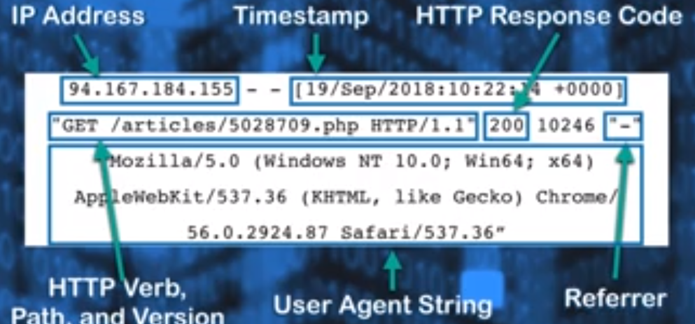

# cybersecurity-python-and-web-applications
Course from stationX

Access Logs:
  Generated by servers when users access the server.
  You can use these logs for debugging, performance monitoring, behaviour analysis of users, 
  Importantly it can be used for security & compliance.
  
  You can look for security issues:
    Leaked Logs,
    Sensitive Data exposure,
    Vulnerable components,
    Escalation Attack
    
    
    Apache web-server provides admin with additional error logs, whichis helpful in further debugging
    
    Where Can I Find the Apache Access Log?#
    For most apache users, the access log will be located at the same location. First, try to navigate
    to one of the following two directories:

    /var/log/apache/access.log
    /var/log/apache2/access.log
    If neither of those paths leads you to the Apache access log file then you may have a custom configuration
    in your Apache config file that defines where the access.log file is located. Try running the following command
    if you can’t end up finding the file sudo locate access.log
    
    There are lot of log analysis tools available in market which can cruch the numbers fast for you.
    
    please go throght the python code: log_analyzer.py
